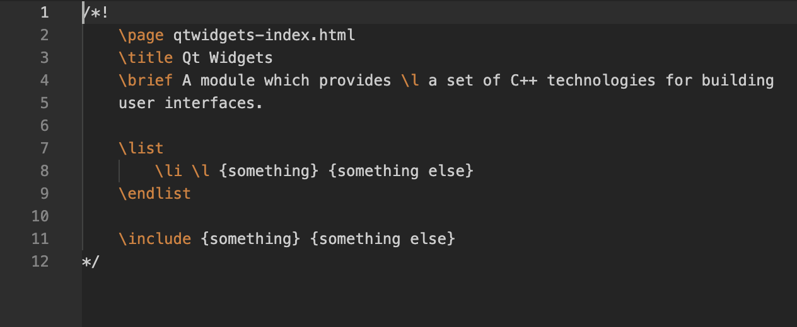

# QDoc Language Support

Syntax highlighting for [QDoc markup](https://doc.qt.io/qt-6/27-qdoc-commands-alphabetical.html) in `.qdoc` and `.qdocinc` files, and inside C++ `/*! ... */` documentation comment blocks.

## Features

### Standalone `.qdoc` / `.qdocinc` files

Full semantic highlighting for all QDoc command categories:

- **Inline formatting** — `\b`, `\bold`, `\e`, `\i`, `\c`, `\tt`, `\l`, `\a`, `\uicontrol`, `\sub`, `\sup`, `\tm`, `\underline`
- **Headings** — `\section1`–`\section4`, `\title`, `\subtitle`
- **Topic commands** — `\class`, `\fn`, `\page`, `\enum`, `\property`, `\qmltype`, and more
- **Block commands** — `\list`/`\endlist`, `\table`/`\endtable`, `\if`/`\endif`, `\div`/`\enddiv`, etc.
- **Code fences** — `\code`/`\endcode`, `\qml`/`\endqml`, `\badcode`/`\endbadcode`
- **Cross-references** — `\sa`, `\keyword`, `\target`
- **Images** — `\image`, `\inlineimage` (filename and alt text highlighted separately)
- **Warnings/notes** — `\warning`, `\deprecated`, `\note`, `\preliminary`
- **Conditionals** — `\if`, `\else`, `\endif`
- **Custom macros** — any `\unknownCommand` is highlighted as a generic keyword

### C++ and QML injection

QDoc commands inside `/*! ... */` doc comment blocks in `.cpp`, `.c`, and `.qml` files are highlighted automatically — no extra configuration needed.

## Supported file types

| Extension | Description |
|-----------|-------------|
| `.qdoc`   | Standalone QDoc topic file |
| `.qdocinc` | QDoc include fragment |
| `.cpp`, `.c` | C++ source — QDoc highlighting inside `/*! */` blocks |
| `.qml`       | QML source — QDoc highlighting inside `/*! */` blocks |
